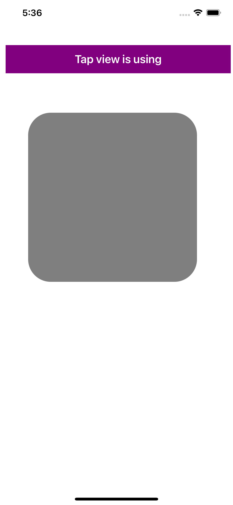
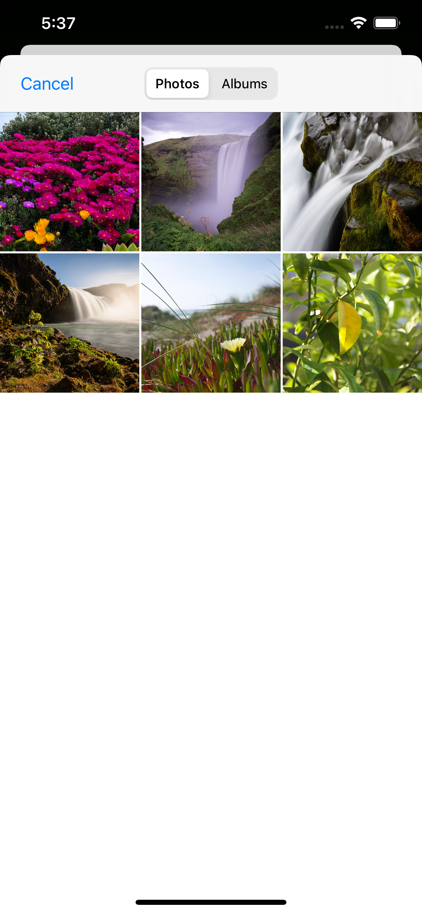
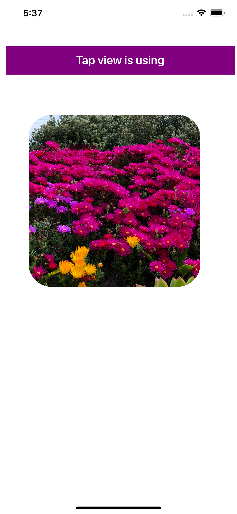
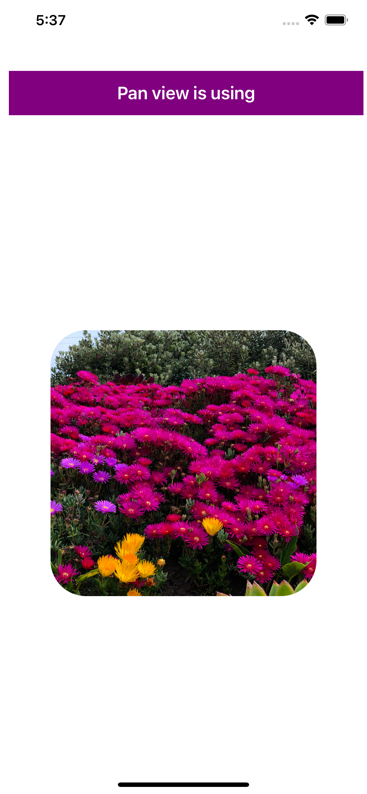
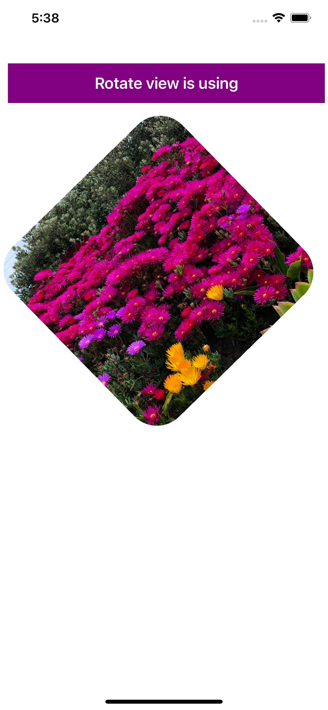
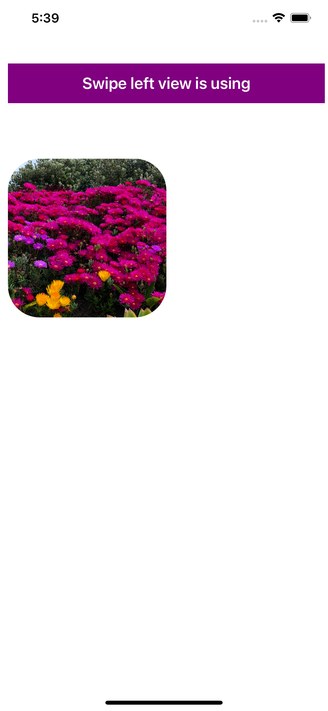
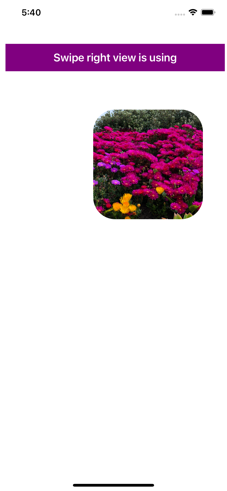
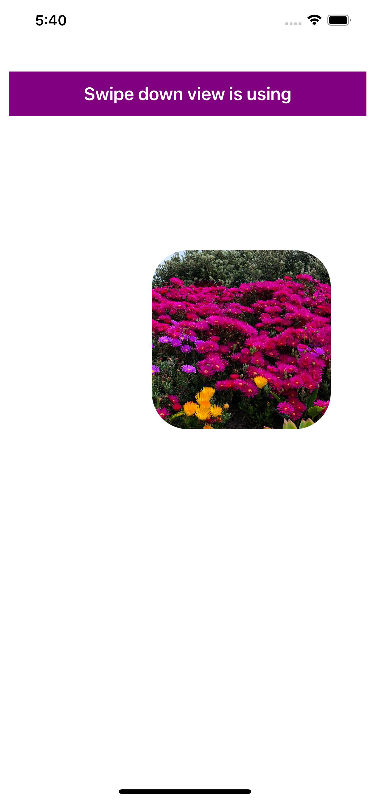
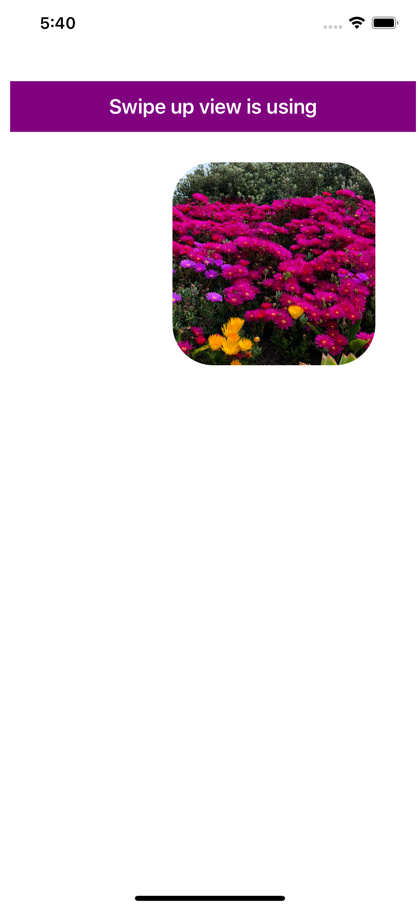

# ImaGestures
In this Application I have used All kind of Gestures

[1] Tap View 

[2] Pan View

[3] Pinch View

[3] Rotate View

[3] Left Swipe View

[3] Right Swipe View

[3] Down Swipe View

[3] Up Swipe View

